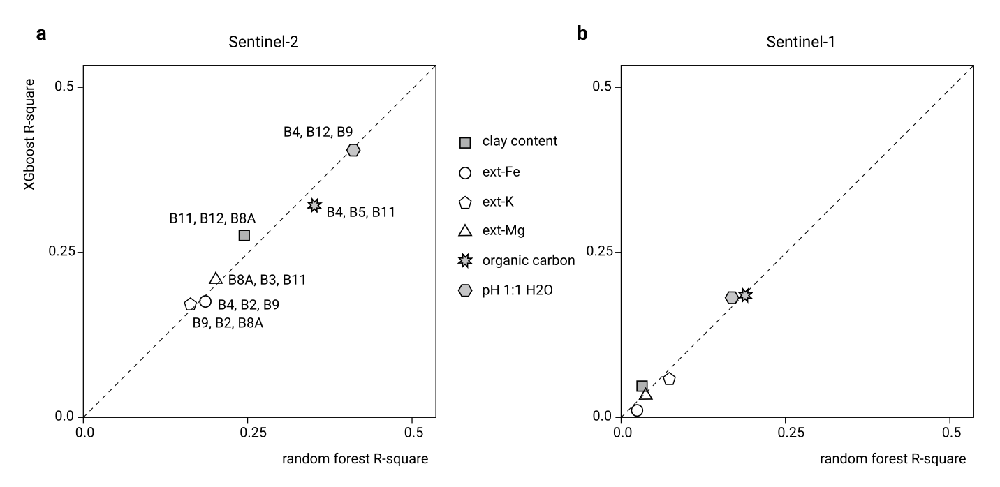

<!-- <link rel="stylesheet" href="../reveal.js/dist/reveal.css">
<link rel="stylesheet" href="../reveal.js/dist/theme/sky.css">   -->

# IntelliDigest Weekly Meeting

Author: Beining Xu

Date: 28 Feb 2024

---

# Two Papers

- African soil properties and nutrients mapped at 30 m spatial resolution using two‐scale ensemble machine learning (Today)

- Earth Observation Data-Driven Cropland Soil Monitoring: A Review (Next week)

---

# *Overview*

African *soil properties and nutrients mapped* at 30 m spatial resolution using two‐scale ensemble machine learning

<!-- --- -->

<!-- # Goals

- Classification Tasks

1. Utilize an improved predictive mapping framework: spatially-adjusted Ensemble Machine Learning, that better accounts for spatial clustering of points;
2. Invest more effort into fine-tuning the Machine Learning algorithms: especially to account for spatial cluster- ing of points, and more efficiently subset features of interest;
3. Include in the prediction process new, state-of-the-art, Earth Observation data: especially Sentinel-2 imagery which is available for the entire continent at fine spatial resolutions (10–30 m);
4. Include per pixel error predictions i.e. to quantify prediction uncertainty per pixel. -->

---

# Methodolgy

- Two‐scale ensemble machine learning
<!-- - Spatial Cross-Validation () -->
- Ensembling of multiple learners

---

#### Two‐scale ensemble machine learning
- Principle: Using two set of Fine-grained and Coarse-grained Level to build the model.
- For example
    - 350 covariate layers at a resolution of 250 m
    - 60 covariate layers at a resolution of 30 m
- Fomula
$y(\phi, \theta, d) = d + x_1(\phi, \theta) + x_2(\phi, \theta) + \cdots + x_p(\phi, \theta)$
- Effects
    - Complexity and Computation Cost 
    - Accuracy Improvement 
    - Robustness Against Overfitting 

<!-- ---

## Spatial Cross-Validation -->

---

## Ensembling of multiple learners

- Multi-learners Linear Combination

$$y(S_B) = S_4(S_B) + S_3(S_B) + S_2(S_B) + S_1(S_B) + \varepsilon$$

where S4 is the value of the target variable estimated at the coarsest scale, S3, S2 and S1 are the higher order components, sB is the location or block of land, and ε is the residual soil variation i.e. pure noise.
In this work we used a somewhat simplified version of Eq. 

---

with only two scale-components: coarse (S2; 250 m) and fine (S1; 30 m). 

produce the coarse-scale and fine-scale predictions independently, then merge using a weighted average

$$\hat{y}(S_B) = \frac{\sum_{i=1}^{2} w_i \cdot S_i(S_B)}{\sum_{i=1}^{2} w_i},$$

$$\quad w_i = \frac{1}{\sigma^2_{i,CV}}$$

---

# Implement

Feature Selection and Model Selection

paraments meaning

- numerical value 
- diagonal  

---

# Thank you!
