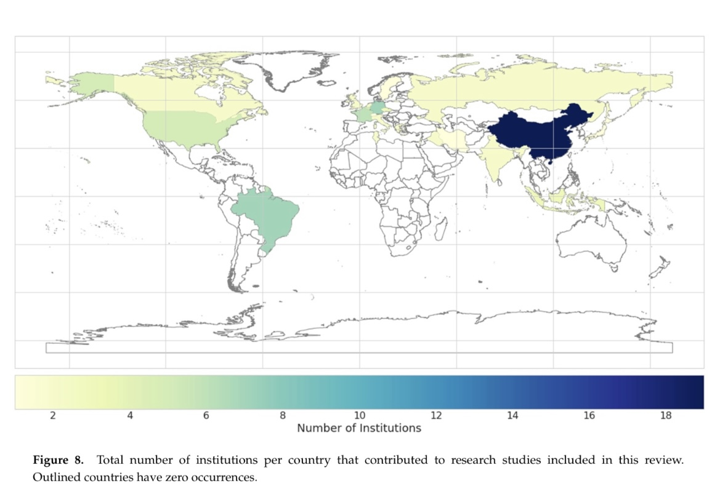

---

author: Beining Xu
title: IntelliDigest Weekly Meeting
date: Feb 26, 2024

---

<link rel="stylesheet" href="../reveal.js/dist/reveal.css">
<link rel="stylesheet" href="../reveal.js/dist/theme/sky.css">  

# IntelliDigest Weekly Meeting

Author: Beining Xu

Date: 6 Mar 2024

---

# Two Papers

- (*)African soil properties and nutrients mapped at 30 m spatial resolution using two‐scale ensemble machine learning

- Earth Observation Data-Driven Cropland Soil Monitoring: A Review

---

#### Two‐scale ensemble machine learning

$y(\phi, \theta, d) = d + x_1(\phi, \theta) + x_2(\phi, \theta) + \cdots + x_p(\phi, \theta)$

- Meanings of parameters
    - $\phi$,  $\theta$ :  geograghical coordinates
    - $p$ : number of covariates
    - $d$ : depth and other unobserved factors
    - $x_p(\phi, \theta)$ : covariates of different sample point

---

# Two Papers

- African soil properties and nutrients mapped at 30 m spatial resolution using two‐scale ensemble machine learning

- (*)Earth Observation Data-Driven Cropland Soil Monitoring: A Review

---

## Earth Observation Data-Driven Cropland Soil Monitoring: A Review

- A review of Earth Observation.

- After an overview of this paper, I judge that this paper is not too useful for my practical work, but...

---

{:height="70%" width="70%"}

Obviously, China have more contribution than other countries.

---

## More reseaches from China

1. [**"Machine learning and soil sciences: a review aided by machine learning tools"**](https://soil.copernicus.org/articles/6/35/2020/) (Recommended)

2.  [**China Soil Database - a national soil data set based on the second soil census**](http://soildata.issas.ac.cn/Uploads/file/20211207/18210d28310c0fca3f49721d160b9437.pdf) (Chinese version, Instructive)

3. [**Prediction of national forest soil organic matter content based on GF-1 remote sensing data**](https://www.researchgate.net/profile/Zhengyong-Zhao-2/publication/355440505_2021_liyingying_zhao_turang_jiyuGF-1yaoganshujuyucequyusenlinturangyoujizhihanliang/links/6170ab9d750da711ac61e186/2021-liyingying-zhao-turang-jiyuGF-1yaoganshujuyucequyusenlinturangyoujizhihanliang.pdf)[3](https://www.researchgate.net/profile/Zhengyong-Zhao-2/publication/355440505_2021_liyingying_zhao_turang_jiyuGF-1yaoganshujuyucequyusenlinturangyoujizhihanliang/links/6170ab9d750da711ac61e186/2021-liyingying-zhao-turang-jiyuGF-1yaoganshujuyucequyusenlinturangyoujizhihanliang.pdf) (Chinese version, Instructive)

---

## 1. Machine learning and soil sciences: a review aided by machine learning tools

- A good review article
- 12 Main topics in this reigions

---

# 4 Questions

- Which ML methods are commonly used and how often have they been used?  
- In which areas of soil sciences do we use ML, and how are they clustered and related?  
- Do advanced ML methods perform significantly better than linear or non-linear statistical approaches?  
- Can ML methods simulate soil processes in space and time?

---

### 1) Which ML methods are commonly used and how often have they been used?

- Advanced methods like Random Forests have shown rapid adoption due to their versatility in various soil science applications, 

- Better than traditional models like SVMs and Decision Trees.

---

### 2) In which areas of soil sciences do we use ML, and how are they clustered and related?

- (*)Remote sensing
- (*)Soil organic carbon (SOC,SOM)
- Water
- Contamination
- (*)Ensembles Methods
- (?)Erosion/parent material
- Methods (NN, SVM)
- (*)Spectroscopy
- Modelling (classification \& regression )
- (*)Crops
- Physical

---

### 3) Do advanced ML methods perform significantly better than linear or non-linear statistical approaches?

- Advanced ML methods generally outperform simpler statistical models

- capture complex non-linear relationships more effectively

---

### 4) Can ML methods simulate soil processes in space and time?

ML methods are good at predict evolution of the soil

---

### 2.  China Soil Database - a national soil data set based on the second soil census

China has a detailed database, which is the result of a professional and authoritative investigation team, which has some inspiration for our next research. Some countries and regions may have similar surveys, and if we can take advantage of these studies, for example, using this kind of exhaustive survey as a good test set to train our model built by data from Google Earth, we can increase the robustness of the model.

---

    
### 3. Prediction of national forest soil organic matter content based on GF-1 remote sensing data

- Input: Different categories according to vegetation types

- Output: SOM,  soil organic matter (SOC)

---

# Thank you!
